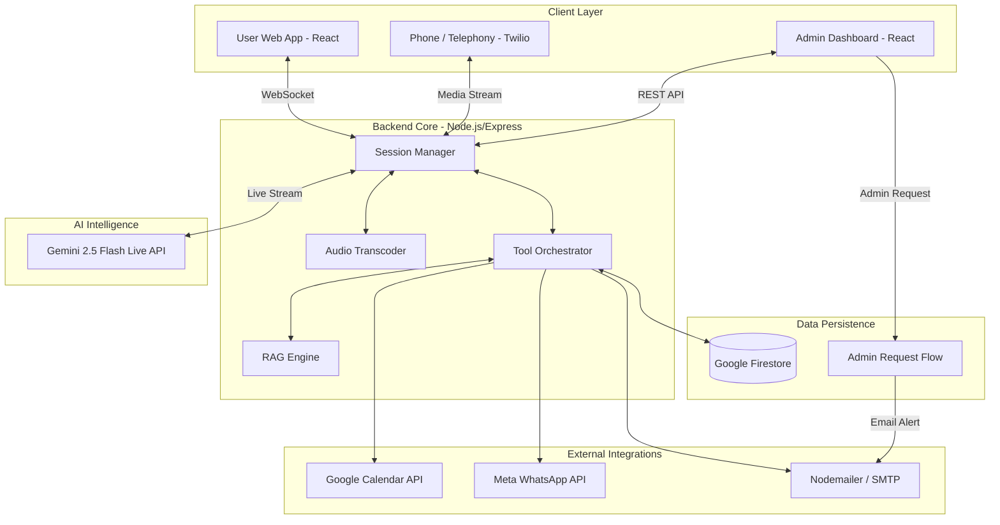

# Drisa_AI Agent

A professional multilingual AI Voice Support Agent built with React, Express, and Gemini 2.5 Flash.


## Architecture

<p align="center">
  
</p>

### 📊 System Flow (Mermaid)



### 🔄 Workflow Overview

1.  **Multimodal Ingress**: Users engage via a high-fidelity React web interface or traditional telephony (Twilio), establishing a low-latency WebSocket or Media Stream connection.
2.  **Real-time Stream Orchestration**: The Node.js/Express backend acts as a high-performance proxy, performing real-time audio transcoding (mu-law ↔ PCM) and managing stateful sessions.
3.  **Gemini 2.5 Flash Intelligence**: The core AI engine utilizes the **Gemini 2.5 Flash Multimodal Live API** to process raw audio streams directly, enabling native understanding of tone, emotion, and multilingual nuances.
4.  **Autonomous Tool Execution**: Based on user intent, the agent autonomously invokes specialized tools to query the Firestore-backed product catalog, schedule appointments via Google Calendar OAuth, or dispatch follow-ups via Meta WhatsApp and SMTP.
5.  **Persistent Memory & Analytics**: Every interaction is captured in **Google Firestore**, providing a rich dataset for lead management, conversation history, and business intelligence.

## 🌟 Key Features

*   **Native Multimodal Voice**: Leverages Gemini 2.5 Flash for ultra-low latency, natural-sounding voice interactions without the need for separate STT/TTS layers.
*   **Multilingual Fluency**: Native support for English, Hausa, Igbo, Yoruba, and Nigerian Pidgin, with automatic language detection and switching.
*   **Intelligent RAG Catalog**: A semantic search engine that allows the agent to provide expert technical advice on solar, CCTV, and smart home products.
*   **Enterprise Integrations**: Production-ready connectors for **Google Calendar** (Scheduling), **Meta WhatsApp** (Engagement), and **Nodemailer** (Notifications).
*   **Admin Command Center**: A robust dashboard for business owners to manage knowledge bases, track leads, and monitor agent performance.
*   **Admin Request & Approval System**: A secure workflow for testers and sub-admins to request access, with automated email notifications to the super admin for immediate approval.
*   **Telephony-Ready**: Built-in support for Twilio Media Streams, bridging the gap between modern AI and traditional phone systems.

---

## 🎯 How to Use the Agent

Drisa_AI is designed to provide a seamless, human-like experience for both customers and business administrators.

### For Customers & Users
Experience the future of customer engagement by interacting with Drisa through our multimodal interfaces:

*   **Voice Interaction**: Engage in natural, low-latency conversations with Drisa. Simply speak, and the AI will respond in real-time with a rhythmic Nigerian professional tone.
*   **Multilingual Support**: Speak in English, Hausa, Igbo, Yoruba, or Nigerian Pidgin. Drisa detects your language and responds accordingly.
*   **Product Inquiries**: Ask about solar systems, CCTV installations, or smart home solutions. Drisa provides instant, accurate information from the product catalog.

### For Business Owners & Admins
Manage your AI workforce through the centralized dashboard:

*   **Knowledge Management**: Upload and process business documents to keep Drisa's knowledge base up-to-date.
*   **Lead Tracking**: Monitor customer interactions and automated follow-ups in real-time.
*   **Admin Authorization**: Manage sub-admin access requests with a built-in approval workflow and real-time notifications.
*   **System Configuration**: Securely manage OAuth connections for Google Calendar and Meta WhatsApp integrations.

---

## 🛠️ Demo Capabilities

The Drisa_AI demonstration showcases a production-ready AI agent capable of handling complex business workflows:

*   **Multimodal Conversational AI**: Seamlessly switches between voice and text inputs with high-fidelity audio output.
*   **Intelligent Tool Orchestration**:
    *   **Google Calendar**: Automatically books site visits and consultations based on natural language requests.
    *   **Meta WhatsApp API**: Sends professional, real-time follow-up messages to capture leads.
    *   **Email Integration**: Dispatches detailed product information and lead notifications via SMTP.
*   **RAG-Powered Product Catalog**: Performs semantic search across the DrisaTech product line to provide precise technical advice.
*   **Real-time Telephony**: Integrated with Twilio to handle standard phone calls, bringing AI intelligence to traditional voice channels.

---

## 🔗 Access the Demo

Experience Drisa_AI live through the following portals:

**For Customers (Widget Mode):**
[https://drisa-ai-agent-448742322230.us-central1.run.app?mode=widget](https://drisa-ai-agent-448742322230.us-central1.run.app?mode=widget)

**For Business Owners (Full Dashboard):**
[https://drisa-ai-agent-448742322230.us-central1.run.app](https://drisa-ai-agent-448742322230.us-central1.run.app)

---

## 🚀 Spin-up Instructions

### 1. Prerequisites
- **Node.js** (v18+)
- **Google Cloud Project** with Billing enabled.
- **Gemini API Key** from [Google AI Studio](https://aistudio.google.com/).
- **Firebase Project** with Firestore enabled.
- **Meta Developer Account** (for WhatsApp Business API).
- **Twilio Account** (for Telephony & Voice integration).
- **Google Cloud Console** (for Calendar OAuth 2.0).

### 2. Local Setup
1. **Clone the repository**:
   ```bash
   git clone https://github.com/Drisatech/drisa-ai-agent.git
   cd drisa-ai-agent
   ```
2. **Install dependencies**:
   ```bash
   npm install
   ```
3. **Configure Environment Variables**:
   Create a `.env` file in the root directory and add your keys:
   ```env
   GEMINI_API_KEY=your_gemini_key
   GOOGLE_CLIENT_ID=your_google_oauth_id
   GOOGLE_CLIENT_SECRET=your_google_oauth_secret
   WHATSAPP_ACCESS_TOKEN=your_meta_token
   WHATSAPP_PHONE_NUMBER_ID=your_phone_id
   SMTP_USER=your_email
   SMTP_PASS=your_email_password
   ```
4. **Run the development server**:
   ```bash
   npm run dev
   ```

### 3. Cloud Deployment (Google Cloud Run)
1. **Continuous Deployment**: Connect your GitHub repository to **Google Cloud Run** via the Cloud Console.
2. **Environment Secrets**: In the Cloud Run service settings, navigate to **Variables & Secrets** and add all environment variables mentioned above.
3. **Build & Deploy**: Push your changes to the `main` branch. Cloud Build will automatically containerize and deploy your application.

---

## 🔌 Integration & Embedding

You can easily integrate Drisa_AI into any website, including **WordPress**, **Wix**, **Shopify**, or custom-built platforms.

### 1. Universal Embed Script (Floating Widget)
Copy and paste this code before the closing `</body>` tag of your website. By default, it appears at the **bottom-right** by default.

```html
<script 
  src="https://drisa-ai-agent-448742322230.us-central1.run.app/embed.js" 
  data-mode="widget"
  data-position="bottom-right"
  async>
</script>
```

**Customization Options:**
- `data-position`: Change to `bottom-left`, `top-right`, or `top-left`.
- `data-mode`: Set to `widget` for the floating assistant.

### 2. Inline Placement (Specific Section)
If you want the agent to appear inside a specific section of your page (e.g., a "Contact Us" div), use the `data-container` attribute:

```html
<!-- 1. Create a container with a unique ID -->
<div id="drisa-ai-container"></div>

<!-- 2. Add the script with the data-container attribute -->
<script 
  src="https://drisa-ai-agent-448742322230.us-central1.run.app/embed.js" 
  data-container="drisa-ai-container"
  async>
</script>
```

### 3. WordPress Integration
To add Drisa_AI to your WordPress site:
1.  Log in to your **WordPress Admin Dashboard**.
2.  Install a plugin like **"Insert Headers and Footers"** (WPCode).
3.  Go to **Code Snippets** -> **Header & Footer**.
4.  Paste the **Universal Embed Script** into the **Footer** section.
5.  Click **Save Changes**.

Alternatively, you can add it to your theme's `footer.php` file just before the `<?php wp_footer(); ?>` tag.

---

## 🛠️ Troubleshooting

### 1. Login Issues (Firebase Auth)
If you encounter errors like `ERR_QUIC_PROTOCOL_ERROR` or `auth/unauthorized-domain` during login:

*   **Authorized Domains**: Ensure your deployment URL is added to the **Authorized Domains** list in the Firebase Console.
    1. Go to [Firebase Console](https://console.firebase.google.com/).
    2. Select your project.
    3. Go to **Authentication** > **Settings** > **Authorized domains**.
    4. Add your Cloud Run URL (e.g., `drisa-ai-agent-448742322230.us-central1.run.app`).
*   **Browser Protocol Error**: If you see `ERR_QUIC_PROTOCOL_ERROR`, it's a browser-level issue with the QUIC protocol.
    *   Try a different browser (e.g., Firefox or Safari).
    *   In Chrome, you can temporarily disable QUIC by visiting `chrome://flags/#enable-quic` and setting it to **Disabled**.
*   **Popup Blocked**: Ensure your browser allows popups for your application domain.

### 2. Firestore Permissions
If you see "Missing or insufficient permissions":
*   Ensure you have deployed the `firestore.rules` using the `deploy_firebase` tool or manually in the Firebase Console.
*   Check that you are logged in with an account that has the `admin` role in the `users` collection.

---

## 👨‍💻 About Me

### 🧠 Aliyu Idris Adeiza
**Data Engineer | Data Scientist | Cloud & AI Systems Architect**

I am a mission-driven technologist dedicated to building intelligent systems that solve real-world challenges. With deep expertise in **Data Engineering**, **Machine Learning**, and **Cloud Architecture**, I specialize in transforming complex data into actionable insights and scalable AI solutions. My work is centered at the intersection of innovation and social impact, leveraging cutting-edge technology to drive digital transformation in emerging markets.

[](https://linkedin.com/in/aliyu-idris)
[](https://github.com/Drisatech)
[](mailto:drisatech@gmail.com)

---

## 🌍 Vision: AI for Inclusive Prosperity

The vision for **Drisa_AI** extends beyond a simple support tool; it is a commitment to **Inclusive AI** that bridges the digital divide. In Nigeria and across Africa, millions remain underserved due to literacy barriers, physical disabilities, or lack of access to traditional digital interfaces.

### My Objectives:
*   **Bridging the Gap**: By prioritizing **Voice-First** and **Multilingual** interaction, Drisa_AI empowers the uneducated and underserved to interact with technology naturally, in their own language.
*   **Accessibility for All**: Providing a hands-free, voice-driven interface that ensures people with disabilities have equal access to information and services.
*   **Economic Empowerment**: Enabling SMEs—the backbone of the Nigerian economy—to scale their operations, generate leads, and compete in a global digital economy.
*   **Poverty Reduction**: Driving job creation and business growth through AI-enhanced productivity, directly contributing to the economic upliftment of local communities.

### Contribution to SDGs:
Through my expertise in technology, I am actively contributing to the **United Nations Sustainable Development Goals (SDGs)**:
*   **Goal 8 (Decent Work and Economic Growth)**: By equipping small businesses with enterprise-grade AI tools.
*   **Goal 9 (Industry, Innovation, and Infrastructure)**: Building resilient, inclusive digital infrastructure for emerging markets.
*   **Goal 10 (Reduced Inequalities)**: Democratizing access to AI benefits regardless of education level or physical ability.

---

## 🚀 The Roadmap: Drisa_AI as a SaaS Platform

Drisa_AI is engineered for scale. The roadmap transforms this agent into a comprehensive **AI-as-a-Service (SaaS)** platform designed specifically for the unique needs of emerging markets:

*   **Multi-Tenant Architecture**: Seamless onboarding for thousands of businesses with isolated, secure data environments.
*   **Enterprise Analytics**: Deep insights into customer sentiment, lead conversion rates, and market trends driven by AI.
*   **Custom Agent Personalities**: Allowing businesses to define their agent's voice, tone, and cultural cadence to match their brand identity.
*   **Industry-Specific Verticalization**: Pre-trained models and knowledge bases for Healthcare, Agriculture, Retail, and FinTech.
*   **API-First Ecosystem**: Enabling third-party developers to build specialized tools and integrations on top of the Drisa_AI core.

---

## 🧾 License & Hackathon Context

This project was developed specifically for the **Gemini Live Agent Hackathon** on **Devpost**. 

Drisa_AI is an open-source initiative provided under the **MIT License**. We encourage developers and businesses to explore, contribute, and join us in our mission to democratize access to AI technology across Africa.

---

**Hackathon Submission Details:**
- **Platform:** Devpost
- **Challenge:** Gemini Live Agent Hackathon
- **Core Focus:** Multimodal Live API, Real-time Voice Interaction, and Social Inclusivity.

---

> ⭐ If you found this portfolio insightful, feel free to connect or follow for updates on data engineering and AI projects.
